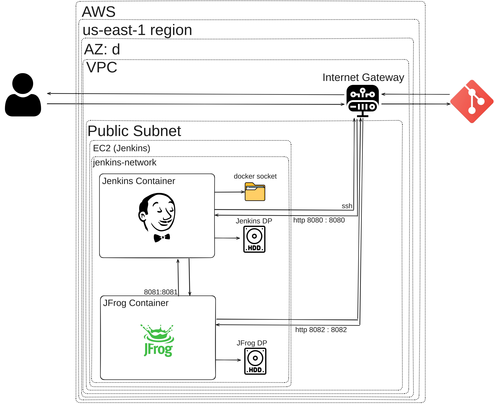

# Thumbnailer

**Thumbnailer** is an application that creates thumbnails using the `imageio` dependency package.

## Project Overview

This project demonstrates a classic CI pipeline utilizing Jenkins and Artifactory to manage and deploy the Thumbnailer application. 

### CI Pipeline Components

The CI pipeline for this project is designed to ensure smooth integration and deployment of the Thumbnailer app. It leverages the following Jenkins components:

- **Maven Integration Plugin**: This plugin integrates Maven with Jenkins, enabling seamless build processes and dependency management.
- **Config File Provider Plugin**: This plugin is used to upload and manage a `settings.xml` file, which configures Jenkins to integrate with Artifactory.
- **Maven 3.6.2**: This version of Maven is configured as the build tool for compiling and managing project dependencies.
